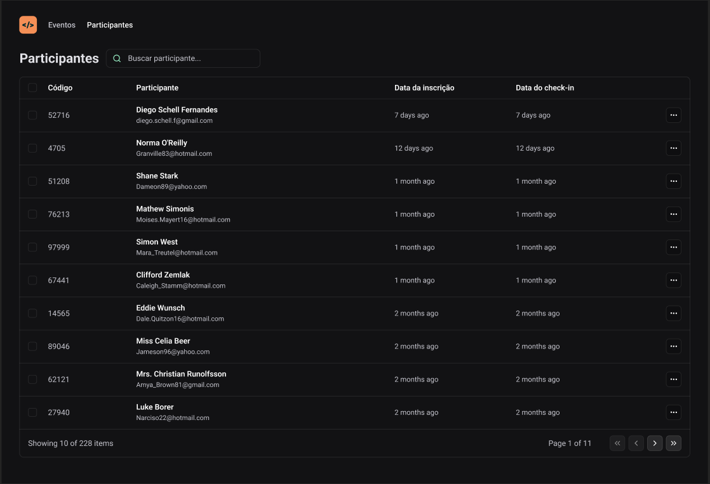

### 💻 Projeto

Projeto da @rocketseateducation para aprimoramento em Reactjs e o uso de URL states parar persistir alguns parâmetro

## ✨ Tecnologia

- [TypeScript](https://www.typescriptlang.org/)
- [React](https://reactjs.org/)
- [Tailwind](https://tailwindcss.com/)

## 🚀 Como executar

Em todos os projetos, ao acessar a pasta, é preciso baixar os pacotes com o gerenciador de sua preferencia.

## 🔖 Layout

Você pode visualizar o layout do projeto através do link abaixo:

- [Layout](<https://www.figma.com/file/gxAI0ExNA0GkDAdzptVH9p/pass.in-(Community)?type=design&node-id=4003-2975&mode=design&t=qIppDzkmwsxmJIBk-0>)

Lembrando que você precisa ter uma conta no [Figma](http://figma.com/).

## 📝 License

Esse projeto está sob a licença MIT. Veja o arquivo [LICENSE](LICENSE) para mais detalhes.

## 🖼️ Imagens

